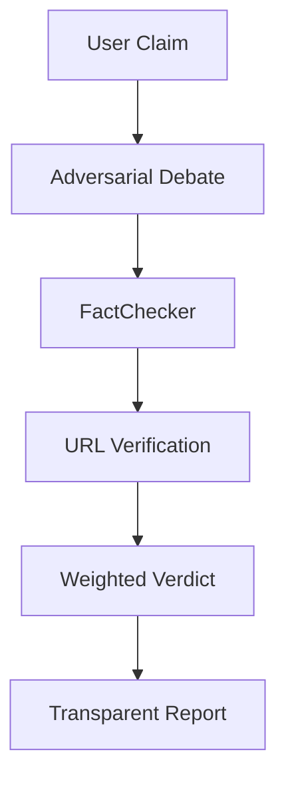

# 🦅 InsightSwarm: Multi-Agent Fact-Checking System

[](https://www.python.org/downloads/release/python-3110/)
[](https://streamlit.io/)
[](https://opensource.org/licenses/MIT)

InsightSwarm is a state-of-the-art multi-agent system designed to verify complex claims using adversarial debate and rigorous source verification. By leveraging multiple LLM providers (Groq, Gemini) and semantic caching, it provides transparent, fact-based verdicts while actively detecting AI hallucinations.

---

## 📖 Table of Contents
1. [Prerequisites](#-prerequisites)
2. [Quick Start](#-quick-start)
3. [Detailed Installation](#-detailed-installation)
4. [Environment Configuration](#-environment-configuration)
5. [How to Generate API Keys](#-how-to-generate-api-keys)
6. [Usage Guide](#-usage-guide)
7. [Antigravity / VS Code Integration](#-antigravity--vs-code-integration)
8. [Architecture](#-architecture)
9. [Troubleshooting](#-troubleshooting)

---

## 🛠 Prerequisites

Before starting, ensure you have the following installed on your machine:

- **Python 3.11+**: The system is optimized for Python 3.11 features. [Download here](https://www.python.org/downloads/).
- **Git**: For cloning the repository.
- **VS Code / Antigravity**: Recommended IDE for the best development experience.
- **Internet Connection**: Required for API calls to LLM providers.

---

## 🚀 Quick Start (For Experts)

```bash
git clone https://github.com/AyushDevadiga1/Insight-Swarm.git
cd InsightSwarm
python -m venv .venv
source .venv/bin/activate  # Windows: .venv\Scripts\activate
# OR (Windows PowerShell)
.\.venv\Scripts\Activate.ps1
pip install -r requirements.txt
# Create .env and add GROQ_API_KEY, GEMINI_API_KEY, TAVILY_API_KEY
streamlit run app.py
```

---

## 📥 Detailed Installation

### Step 1: Clone the Repository
Open your terminal (or Antigravity terminal) and run:
```bash
git clone https://github.com/AyushDevadiga1/Insight-Swarm.git
cd InsightSwarm
```

### Step 2: Set Up Virtual Environment
Creating a virtual environment ensures that the project's dependencies don't conflict with your global Python setup.
```bash
# Create the environment
python -m venv .venv

# Activate it (Windows CMD)
.venv\Scripts\activate

# Activate it (Windows PowerShell)
.\.venv\Scripts\Activate.ps1

# Activate it (Mac/Linux)
source .venv/bin/activate
```
> [!TIP]
> You will know it's activated when you see `(.venv)` at the start of your terminal prompt.

### Step 3: Install Dependencies
Install all required libraries including Streamlit, LangGraph, and various LLM clients.
```bash
pip install -r requirements.txt
```

---

## 🔑 Environment Configuration

The system requires API keys to interact with Large Language Models. These keys must be stored in a `.env` file in the root directory.

### Create the .env File
In the root directory of `InsightSwarm`, create a file named `.env` and add the following content:

```env
# Required: Groq API Key (Primary Provider)
GROQ_API_KEY=your_groq_key_here

# Required: Google Gemini API Key (Fallback Provider)
GEMINI_API_KEY=your_gemini_key_here

# Required: Tavily API Key (Search/Verification)
TAVILY_API_KEY=your_tavily_key_here

# Optional: LLM Configuration
LLM_TEMPERATURE=0.7
MAX_TOKENS=2000
```

> [!IMPORTANT]
> Never commit your `.env` file to GitHub. It is already included in `.gitignore`.

---

## 🔑 How to Generate API Keys

If you don't have the API keys yet, follow these steps to create them:

### 1. Groq API Key
1. Visit the [Groq Console](https://console.groq.com/).
2. Sign up or log in with your account.
3. Navigate to the **"API Keys"** section on the left sidebar.
4. Click **"Create API Key"**, give it a name (e.g., "InsightSwarm"), and copy the generated key.

### 2. Google Gemini API Key
1. Go to [Google AI Studio](https://aistudio.google.com/).
2. Log in with your Google account.
3. Click on the **"Get API key"** button on the top left.
4. Click **"Create API key in new project"**.
5. Copy the key once it's displayed.

### 3. Tavily API Key
1. Go to [Tavily AI](https://tavily.com/).
2. Click **"Sign Up"** or **"Login"**.
3. Once logged in, you will be taken to your **API Dashboard**.
4. Copy the API Key shown under the "Overview" tab.

---

## 🎮 Usage Guide

### 1. Web Interface (Recommended)
The Streamlit interface provides a visual, interactive experience showing real-time debate progress.
```bash
streamlit run app.py
```
After running, your browser should open automatically to `http://localhost:8501`.

### 2. Command Line Interface (CLI)
For quick verification directly in the terminal:
```bash
python main.py
```

---

## 🌌 Antigravity / VS Code Integration

If you are using **Antigravity** or **VS Code**, follow these tips for a better workflow:

1. **Python Interpreter**: Press `Ctrl+Shift+P` and type "Python: Select Interpreter". Choose the one pointing to `.venv/Scripts/python.exe`.
2. **Integrated Terminal**: Use the built-in terminal (`Ctrl+` `) to keep your environment active while you code.
3. **Environment Variables**: The IDE automatically detects `.env` files, making it easy to manage your API keys.

---

## 🏗 Architecture

InsightSwarm operates on a "Trust but Verify" model:

1. **Adversarial Debate**: A `ProAgent` and `ConAgent` debate the claim for 3 rounds.
2. **Fact Verification**: The `FactChecker` agent extracts URLs from the debate and verifies their existence and content.
3. **Consensus**: The `Moderator` analyzes the debate and verification results to produce a final verdict.
4. **Weighted Scoring**: Claims backed by verified sources get higher weight than those with unverified or hallucinated links.



---

## ❓ Troubleshooting

- **ModuleNotFoundError**: Ensure your virtual environment is activated and you ran `pip install -r requirements.txt`.
- **API Quota Errors**: If you hit a rate limit, the system automatically attempts to switch to your fallback provider (e.g., Gemini). Ensure both keys are set for maximum resilience.
- **Port 8501 Busy**: If Streamlit won't start, another app is using the port. Try `streamlit run app.py --server.port 8502`.
- **Missing API Keys**: The system will raise a `RuntimeError` on startup if mandatory keys (Groq, Gemini, Tavily) are missing from `.env`.

---

## 📜 License
This project is licensed under the MIT License - see the LICENSE file for details.

---
*Created by [Ayush Devadiga](https://github.com/AyushDevadiga1)*