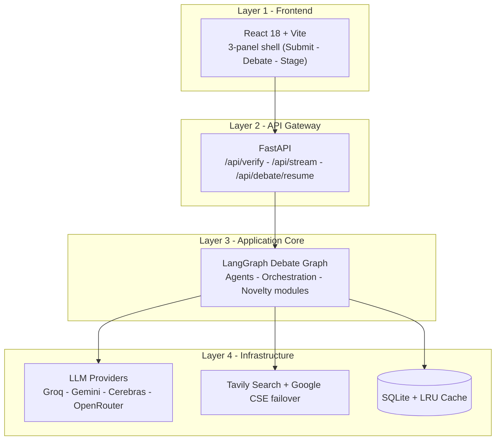
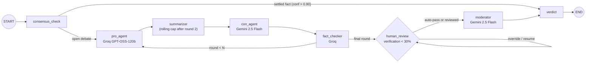
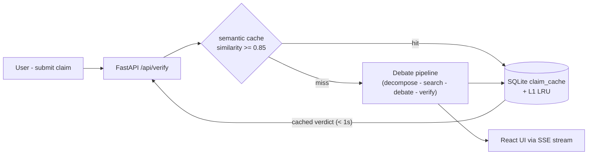
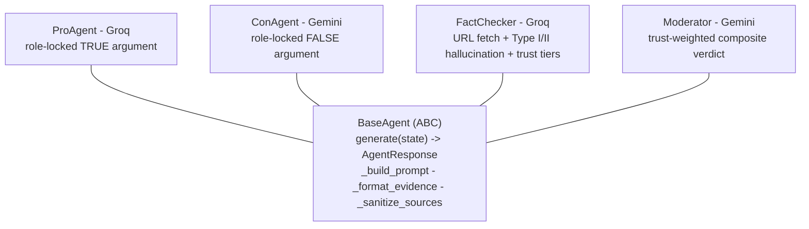
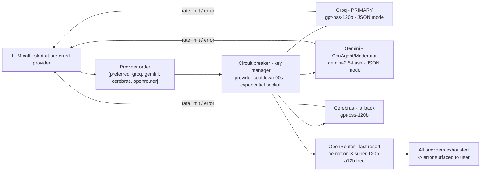

# InsightSwarm 🦅

> **Multi-Agent Fact-Checking through Adversarial Debate, Human-in-the-Loop Oversight, and Adaptive Confidence Calibration**

[](https://www.python.org/downloads/)
[](https://fastapi.tiangolo.com/)
[](https://react.dev/)
[](https://langchain-ai.github.io/langgraph/)
[](https://docs.pydantic.dev/)
[](LICENSE)
[](https://github.com/AyushDevadiga1/Insight-Swarm/actions)
[](paper/InsightSwarm_New_Paper.md)

A **production-grade, research-quality** automated fact-checking system where four specialised AI agents debate claims, verify sources in real-time, and converge on a calibrated verdict — with optional human intervention at any stage. Built entirely on free-tier APIs with zero infrastructure cost.

**Bharat College of Engineering, University of Mumbai**  
Guided by **Prof. Shital Gujar**, Dept. of CSE (AI & ML)

---

## Table of Contents

- [What It Does](#what-it-does)
- [Novel Research Contributions](#novel-research-contributions)
- [High-Level Design (HLD)](#high-level-design-hld)
- [System Architecture Diagram](#system-architecture-diagram)
- [LangGraph Execution Flow](#langgraph-execution-flow)
- [Data Flow Diagram](#data-flow-diagram)
- [Low-Level Design (LLD)](#low-level-design-lld)
- [Agent Design](#agent-design)
- [API Resilience Architecture](#api-resilience-architecture)
- [Frontend Architecture](#frontend-architecture)
- [Database and Caching Layer](#database-and-caching-layer)
- [HITL Flow](#hitl-flow)
- [Tech Stack](#tech-stack)
- [Project Structure](#project-structure)
- [Quick Start](#quick-start)
- [Environment Variables](#environment-variables)
- [Running Benchmarks](#running-benchmarks)
- [Key Metrics](#key-metrics)
- [Development Trajectory](#development-trajectory)
- [Tests](#tests)
- [Citation](#citation)
- [Acknowledgements](#acknowledgements)

---

## What It Does

You submit a claim. InsightSwarm:

1. **Estimates complexity** — ClaimComplexityEstimator scores the claim on semantic, domain, temporal, and evidence-availability dimensions and adjusts debate depth automatically (2–4 rounds, 3–7 minimum sources)
2. **Decomposes** — ClaimDecomposer splits compound claims into atomic sub-claims, processed in parallel
3. **Checks consensus** — A lightweight pre-check detects settled scientific facts (e.g. "vaccines cause autism") and short-circuits debate entirely if confidence > 90%
4. **Retrieves evidence** — Tavily search fetches real web evidence for both PRO and CON sides simultaneously before debate begins
5. **Debates** — ProAgent (🛡️) argues TRUE, ConAgent (⚔️) argues FALSE across N rounds. Each receives the opponent's prior argument and must directly challenge it
6. **Verifies** — FactChecker fetches every cited URL, runs semantic similarity matching, paywall detection, temporal alignment, and domain trust scoring. Detects both **Type I** (fabricated URL) and **Type II** (real URL, fabricated content) hallucinations
7. **Pauses for human review** — if source verification confidence falls below 30%, the LangGraph graph interrupts and emits a `human_review_required` SSE event to the React frontend
8. **Moderates** — Moderator synthesises a trust-weighted composite verdict using argument quality (30%) + verification rate (30%) + domain trust (20%) + consensus pre-check (20%)
9. **Calibrates** — AdaptiveConfidenceCalibrator corrects systematic underconfidence using geometric-mean source trust scoring and debate asymmetry signals
10. **Streams** — every pipeline step is streamed live to the React frontend via Server-Sent Events

---

## Novel Research Contributions

| Contribution | Description | Where |
|---|---|---|
| **Type I + II Hallucination Detection** | Every cited URL is fetched and content-matched. Type I = 404/DNS failure. Type II = real URL whose content doesn't support the agent's claim | `src/agents/fact_checker.py` |
| **Trust-Weighted Composite Verdict** | `S = 0.30×Qarg + 0.30×Vrate + 0.20×Tdomain + 0.20×Ccons` — argument quality, verification rate, domain trust, and consensus pre-check | `src/agents/moderator.py` |
| **HITL via LangGraph Interrupts** | Graph pauses at `interrupt_before=["human_review"]`; React HITLPanel renders per-source override UI; `/api/debate/resume/{id}` resumes from checkpoint | `src/orchestration/debate.py` |
| **Adaptive Confidence Calibration** | Detects systematic underconfidence (`raw < 0.65` while `source_quality > 0.75`). Uses geometric mean (not arithmetic) of trust scores to penalise single weak sources | `src/novelty/confidence_calibration.py` |
| **Claim Complexity Estimation** | Scores semantic + domain + temporal + evidence-availability dimensions. Dynamically sets debate rounds and minimum source count | `src/novelty/claim_complexity.py` |
| **Argumentation Quality Analysis** | 10 logical fallacy types detected per argument (ad hominem, strawman, false dichotomy, appeal to authority, slippery slope, appeal to emotion, hasty generalisation, circular reasoning, red herring, cherry-picking) | `src/novelty/argumentation_analysis.py` |

---

## High-Level Design (HLD)

The system is organised into four logical layers. Each layer has a single responsibility and communicates with the layers above and below it through well-defined interfaces.


```mermaid
flowchart TB
    subgraph L1["Layer 1 - Frontend"]
        UI["React 18 + Vite<br/>3-panel shell (Submit - Debate - Stage)"]
    end
    subgraph L2["Layer 2 - API Gateway"]
        API["FastAPI<br/>/api/verify - /api/stream - /api/debate/resume"]
    end
    subgraph L3["Layer 3 - Application Core"]
        GRAPH["LangGraph Debate Graph<br/>Agents - Orchestration - Novelty modules"]
    end
    subgraph L4["Layer 4 - Infrastructure"]
        LLM["LLM Providers<br/>Groq - Gemini - Cerebras - OpenRouter"]
        RET["Tavily Search + Google CSE failover"]
        CACHE[("SQLite + LRU Cache")]
    end
    UI --> API
    API --> GRAPH
    GRAPH --> LLM
    GRAPH --> RET
    GRAPH --> CACHE
```

---

## System Architecture Diagram


```mermaid
flowchart LR
    START((START))
    CONSENSUS["consensus_check"]
    PRO["pro_agent<br/>Groq GPT-OSS-120b"]
    SUM["summarizer<br/>(rolling cap after round 2)"]
    CON["con_agent<br/>Gemini 2.5 Flash"]
    FACT["fact_checker<br/>Groq"]
    REVIEW{"human_review<br/>verification &lt; 30%"}
    MOD["moderator<br/>Gemini 2.5 Flash"]
    VERDICT["verdict"]
    END((END))
    START --> CONSENSUS
    CONSENSUS -->|"settled fact (conf > 0.90)"| VERDICT
    CONSENSUS -->|"open debate"| PRO
    PRO --> SUM --> CON --> FACT
    FACT -->|"round &lt; N"| PRO
    FACT -->|"final round"| REVIEW
    REVIEW -->|"override / resume"| REVIEW
    REVIEW -->|"auto-pass or reviewed"| MOD
    MOD --> VERDICT
    VERDICT --> END
```

---

## LangGraph Execution Flow

The LangGraph StateGraph compiles to a deterministic execution pipeline with a formal interrupt mechanism for human oversight. The graph supports both `run()` (blocking) and `stream()` (SSE) modes.

**Node sequence:**

| Node | Provider | Responsibility |
|---|---|---|
| `consensus_check` | Gemini | Settled-science short-circuit (conf > 0.90 → skip debate) |
| `summarizer` | — | Rolling history cap; generates summary after round 2 |
| `pro_agent` | Groq GPT-OSS-120b | Role-locked TRUE argument + source citation per round |
| `con_agent` | Gemini 2.5 | Role-locked FALSE argument; must challenge prior PRO argument directly |
| `fact_checker` | Groq | URL batch verify; Type I+II hallucination; domain trust tiers |
| `human_review` | — | **INTERRUPT** — graph pauses; SSE fires; HITLPanel shown |
| `moderator` | Gemini 2.5 | Composite score + ArgumentationAnalyzer + Calibrator |
| `verdict` | — | ExplainabilityEngine + cache write + SSE verdict event |

---

## Data Flow Diagram


```mermaid
flowchart LR
    USER["User - submit claim"]
    API["FastAPI /api/verify"]
    HIT{"semantic cache<br/>similarity >= 0.85"}
    PIPELINE["Debate pipeline<br/>(decompose - search - debate - verify)"]
    STORE[("SQLite claim_cache<br/>+ L1 LRU")]
    SSE["React UI via SSE stream"]
    USER --> API
    API --> HIT
    HIT -->|"hit"| STORE
    STORE -->|"cached verdict (< 1s)"| API
    HIT -->|"miss"| PIPELINE
    PIPELINE --> STORE
    PIPELINE --> SSE
```

---

## Low-Level Design (LLD)

### Core Data Models

```python
DebateState (Pydantic v2 BaseModel)
├── claim: str
├── round: int = 1
├── num_rounds: int = 3
├── pro_arguments: List[str]          # one entry per round
├── con_arguments: List[str]          # one entry per round
├── pro_sources: List[List[str]]      # URLs cited per round
├── con_sources: List[List[str]]
├── pro_evidence: List[Dict]          # Tavily evidence for ProAgent
├── con_evidence: List[Dict]          # Tavily evidence for ConAgent
├── evidence_sources: List[Dict]      # merged, used by FactChecker URL allow-list
├── verification_results: List[Dict]  # SourceVerification records
├── pro_verification_rate: float
├── con_verification_rate: float
├── verdict: str = "UNKNOWN"
├── confidence: float = 0.0
├── moderator_reasoning: str
├── metrics: Dict[str, Any]           # consensus, argumentation_analysis, calibration, explanation
├── is_cached: bool = False
├── summary: str                      # rolling debate summary (after round 2)
├── sub_claims: List[str]
├── retry_count: int = 0
├── human_verdict_override: Optional[str]   # set by HITL resume
└── system_status: Optional[str]

SourceVerification (Pydantic v2 BaseModel)
├── url: str
├── status: Literal["VERIFIED","NOT_FOUND","INVALID_URL","TIMEOUT",
│                   "CONTENT_MISMATCH","PAYWALL_RESTRICTED","ERROR"]
├── confidence: float         # 0.0–1.0
├── similarity_score: float   # cosine similarity
├── trust_score: float        # domain authority weight
├── trust_tier: str           # ACADEMIC / GOVERNMENT / NEWS / GENERAL / LOW
├── agent_source: Literal["PRO","CON"]
├── content_preview: Optional[str]
└── error: Optional[str]
```

### LLM Client — Provider Rotation Logic

```python
FreeLLMClient.call() / call_structured()
│
├── _provider_order(preferred_provider)
│     └── [preferred, groq, gemini, cerebras, openrouter]  (rotated)
│
├── for each provider:
│     ├── CircuitBreaker.is_allowed()?        NO → skip
│     ├── APIKeyManager.has_working_keys()?   NO → skip
│     ├── provider_cooldown not expired?      NO → skip
│     ├── _check_rate_limit()                 EXCEEDED → skip
│     └── _dispatch_call() → success or fallback
│
│     On success → CircuitBreaker.record_success()
│     On rate limit → set_provider_cooldown(90s) → try next
│     On other error → record_failure() → exponential backoff (cap 8s)
│
└── All providers failed → raise RuntimeError (surfaced gracefully to user)
```

---

## Agent Design


```mermaid
flowchart BT
    BASE["BaseAgent (ABC)<br/>generate(state) -> AgentResponse<br/>_build_prompt - _format_evidence - _sanitize_sources"]
    PRO["ProAgent - Groq<br/>role-locked TRUE argument"]
    CON["ConAgent - Gemini<br/>role-locked FALSE argument"]
    FACT["FactChecker - Groq<br/>URL fetch + Type I/II hallucination + trust tiers"]
    MOD["Moderator - Gemini<br/>trust-weighted composite verdict"]
    BASE --- PRO
    BASE --- CON
    BASE --- FACT
    BASE --- MOD
```

---

## API Resilience Architecture


```mermaid
flowchart LR
    CALL["LLM call - start at preferred provider"]
    ORDER["Provider order<br/>[preferred, groq, gemini, cerebras, openrouter]"]
    CB["Circuit breaker - key manager<br/>provider cooldown 90s - exponential backoff"]
    GROQ["Groq - PRIMARY<br/>gpt-oss-120b - JSON mode"]
    GEM["Gemini - ConAgent/Moderator<br/>gemini-2.5-flash - JSON mode"]
    CER["Cerebras - fallback<br/>gpt-oss-120b"]
    OR["OpenRouter - last resort<br/>nemotron-3-super-120b-a12b:free"]
    FAIL["All providers exhausted<br/>-> error surfaced to user"]
    CALL --> ORDER --> CB
    CB --> GROQ
    CB --> GEM
    CB --> CER
    CB --> OR
    GROQ -->|"rate limit / error"| CALL
    GEM -->|"rate limit / error"| CALL
    CER -->|"rate limit / error"| CALL
    OR --> FAIL
```

---

## Frontend Architecture

```
React 18 + Vite + Zustand

App.jsx (3-panel shell)
├── Sidebar.jsx
│     ├── ClaimInput.jsx          (submit new claim)
│     ├── HistoryList.jsx         (past claims)
│     └── ProviderStatus.jsx      (fallback warnings)
│
├── Main Panel
│     ├── BattleHeader.jsx        (🛡️ ProAgent vs ⚔️ ConAgent live scores)
│     ├── DebateArena.jsx         (live debate transcript, SSE-driven)
│     │     └── AgentBubble.jsx   (per-argument bubble + source hover cards)
│     │           └── SourceHoverCard.jsx  (trust tier, verification status, URL)
│     ├── SubClaimBanner.jsx      (shown when claim is decomposed)
│     └── FallacyPanel.jsx        (detected fallacies per agent)
│
└── Right Panel (StagePanel.jsx)
      ├── Pipeline stages (IDLE → DECOMPOSING → CONSENSUS → SEARCHING →
      │                    PRO → CON → FACT_CHECK → MODERATOR → COMPLETE)
      ├── HITLPanel.jsx           (per-source override dropdowns, amber pulse)
      │     └── triggers on human_review_required SSE event
      │     └── POST /api/debate/resume/{thread_id} on submit
      ├── MetricsGrid.jsx
      │     ├── ArgumentationBlock  (pro/con quality bars, fallacy counts)
      │     ├── CalibrationBlock    (raw → calibrated confidence, adjustment)
      │     └── VerificationTable   (per-URL status badges)
      └── LoadingOrb.jsx          (cinematic loading animation)

State Management (Zustand — useDebateStore.js):
  claim · threadId · status · proArguments[] · conArguments[]
  verificationResults[] · verdict · confidence · metrics · hitlRequired

SSE Hook (useSSE.js):
  Stable UUID runId · EventSource /api/stream/{thread_id}
  Events: stage · sub_claims · pro_argument · con_argument ·
          verification_result · verdict · human_review_required ·
          error · done · heartbeat
  AbortController for clean unmount (no stale connection leaks)
```

---

## Database and Caching Layer

```
SQLite (insightswarm.db)
├── claim_cache table
│     ├── claim_embedding: BLOB   (all-MiniLM-L6-v2, 384-dim float32)
│     ├── verdict_data: TEXT      (full JSON result)
│     ├── created_at, expires_at  (7-day TTL)
│     └── WAL journal mode + NORMAL synchronous
│
└── Lookup algorithm:
      1. Encode incoming claim → 384-dim vector
      2. Load all cached embeddings into NumPy matrix (O(1) amortised — matrix cached by row count)
      3. Cosine similarity: normalise → dot product
      4. Best match ≥ 0.85 → return cached result (< 1s)
      5. Below threshold → run full debate pipeline

L1 In-Memory LRU Cache (BoundedCache):
  Thread-safe OrderedDict + Lock · max 100 entries
  Sits in front of SQLite — avoids disk I/O for hot entries
  Evicts LRU on overflow
```

---

## HITL Flow

```
FactChecker completes → pro_rate < 0.30 AND con_rate < 0.30
        │
        ▼ revision loop (agents regenerate, fact_checker re-runs, max 1×)
        │
        ▼ still < 0.30 after retry?
        │
╔═══════▼══════════════════════════════════╗
║  human_review NODE  (LangGraph INTERRUPT) ║
║  SSE: { type: "human_review_required",    ║
║          verification_results: [...] }   ║
╚═══════════════════════════╤══════════════╝
                            │
            HITLPanel renders in React
            Per-URL override dropdowns
            Optional verdict_override
            [Submit Review] button
                            │ POST /api/debate/resume/{thread_id}
                            ▼
            Backend patches DebateState
            graph.invoke(None, config) resumes from checkpoint
                            │
                            ▼
            moderator node runs with corrected sources
            verdict SSE event fires → user sees result
```

---

## Tech Stack

| Layer | Technology | Version | Role |
|---|---|---|---|
| Backend API | FastAPI | 0.110+ | REST + SSE endpoint server |
| Orchestration | LangGraph | 1.0 | Stateful debate graph |
| State models | Pydantic v2 | 2.x | Type-safe DebateState |
| Checkpointing | MemorySaver | built-in | Per-session graph state isolation |
| Primary LLM | Groq GPT-OSS-120b | latest | ProAgent + FactChecker |
| Secondary LLM | Gemini 2.5 Flash | latest | ConAgent + Moderator |
| Tertiary LLM | Cerebras GPT-OSS-120b | latest | Fallback provider |
| Quaternary LLM | OpenRouter Nemotron-3-Super | :free | Final fallback provider |
| Embeddings | all-MiniLM-L6-v2 | sentence-transformers | Semantic cache + URL matching |
| Search | Tavily API | — | Dual-sided evidence retrieval |
| Search failover | Google Custom Search | — | Auto-failover on 429/403 |
| Cache | SQLite + LRU | built-in | Semantic cache (< 1s hit latency) |
| Rate limiting | slowapi | — | 10 req/min per IP on API routes |
| Frontend | React 18 + Vite | 18 / 5+ | UI framework |
| State mgmt | Zustand | — | Frontend state |
| Streaming | native EventSource | — | SSE client (no library needed) |
| Icons | Lucide React | — | UI icons |
| Fonts | Inter + Fira Code | Google Fonts | Typography |
| Resilience | tenacity | — | Exponential backoff on LLM calls |
| HTML parsing | BeautifulSoup4 | 4.x | URL content extraction |
| Fuzzy match | RapidFuzz | — | URL content vs claim similarity |

---

## Project Structure

```
InsightSwarm/
│
├── api/
│   ├── server.py                  FastAPI app: /verify, /stream, /debate/resume, /health
│   └── websocket_hitl.py          WebSocket manager for HITL (fallback channel)
│
├── src/
│   ├── agents/
│   │   ├── base.py                BaseAgent ABC: format_evidence, sanitize_sources
│   │   ├── pro_agent.py           ProAgent: role-locked TRUE, Groq GPT-OSS-120b
│   │   ├── con_agent.py           ConAgent: role-locked FALSE, Gemini 2.5 Flash
│   │   ├── fact_checker.py        FactChecker: URL fetch + semantic match + trust scoring
│   │   └── moderator.py           Moderator: composite score + verdict normalisation
│   │
│   ├── core/
│   │   └── models.py              DebateState, AgentResponse, SourceVerification (Pydantic v2)
│   │
│   ├── llm/
│   │   └── client.py              FreeLLMClient: 4-provider rotation, circuit breaker, rate limits
│   │
│   ├── novelty/
│   │   ├── argumentation_analysis.py    10-fallacy detector, citation quality, rhetoric scoring
│   │   ├── confidence_calibration.py    AdaptiveConfidenceCalibrator (geometric mean, ECE)
│   │   ├── claim_complexity.py          ClaimComplexityEstimator (semantic/domain/temporal/evidence)
│   │   └── explainability.py            ExplainabilityEngine (feature importance, counterfactuals)
│   │
│   ├── orchestration/
│   │   ├── debate.py              DebateOrchestrator: LangGraph graph + all 9 nodes
│   │   └── cache.py               SemanticCache: SQLite + embeddings + LRU L1
│   │
│   ├── resilience/
│   │   ├── circuit_breaker.py     CircuitBreaker: CLOSED/OPEN/HALF_OPEN per provider
│   │   └── fallback_handler.py    FallbackHandler: wraps graph execution with graceful fallback
│   │
│   ├── ui/
│   │   └── progress_tracker.py    Stage enum + SSE stage/progress mapping
│   │
│   └── utils/
│       ├── api_key_manager.py     APIKeyManager: tri-state key lifecycle
│       ├── claim_decomposer.py    ClaimDecomposer: splits compound claims
│       ├── summarizer.py          Summarizer: rolling debate history compression
│       ├── tavily_retriever.py    TavilyRetriever: adversarial search + Google CSE failover
│       ├── url_helper.py          URLNormalizer: sanitise, dedup, SSRF-filter
│       └── trust_scorer.py        TrustScorer: domain authority tier assignment
│
├── frontend/src/
│   ├── App.jsx                    3-panel shell
│   ├── components/debate/         BattleHeader · DebateArena · AgentBubble
│   ├── components/hitl/           HITLPanel (amber pulse alert)
│   ├── components/pipeline/       StagePanel · SubClaimBanner · FallacyPanel
│   ├── components/results/        MetricsGrid
│   ├── store/useDebateStore.js    Zustand global state
│   └── hooks/useSSE.js            SSE connection with stable UUID + AbortController
│
├── tests/
│   ├── unit/                      Unit tests (235 passing)
│   ├── integration/               HITL, trust weighting, decomposition, circuit breakers
│   ├── load/                      10-user concurrency suite
│   ├── benchmark_suite.py         FEVER benchmark: precision/recall/F1/ECE
│   └── red_team_cases.py          Adversarial prompt injection + edge cases
│
├── scripts/                       download_fever · run_benchmark_quick · run_ablation
├── data/fever_sample.json         100-claim benchmark dataset
├── paper/                         Published IJRASET paper (New_Paper.md tracked)
├── .env                           API keys (gitignored)
└── requirements.txt               Pinned Python dependencies
```

---

## Quick Start

### 1. Clone and install

```bash
git clone https://github.com/AyushDevadiga1/Insight-Swarm.git
cd InsightSwarm
python -m venv .venv
.venv\Scripts\activate   # Windows
# source .venv/bin/activate  # macOS/Linux
pip install -r requirements.txt
```

### 2. Set API keys

Create `.env` in the project root:

```env
# Required (at least one LLM provider)
GROQ_API_KEY=gsk_...
GEMINI_API_KEY=AIza...
TAVILY_API_KEY=tvly-...

# Optional (additional fallback providers)
OPENROUTER_API_KEY=sk-or-v1-...
CEREBRAS_API_KEY=csk_...

# Optional tuning
GROQ_MODEL=openai/gpt-oss-120b
GEMINI_MODEL=gemini-2.5-flash
CEREBRAS_MODEL=gpt-oss-120b
OPENROUTER_MODEL=nvidia/nemotron-3-super-120b-a12b:free
SEMANTIC_CACHE_ENABLED=1
```

**Free API keys:**

| Provider | Link | Free Tier |
|---|---|---|
| Groq | https://console.groq.com | 14,400 req/day |
| Gemini | https://aistudio.google.com | 250 req/day |
| Tavily | https://tavily.com | 1,000 searches/month |
| Cerebras | https://cloud.cerebras.ai | Free tier available |
| OpenRouter | https://openrouter.ai | Free tier available |

### 3. Start the backend

```bash
python -m uvicorn api.server:app --host 127.0.0.1 --port 8000 --reload
```

### 4. Start the frontend

```bash
cd frontend
npm install
npm run dev
# → http://localhost:5173
```

### 5. Submit a claim

Open http://localhost:5173 and try:

```
"Drinking coffee reduces the risk of type 2 diabetes"
"The James Webb Space Telescope launched in 2021"
"5G towers cause COVID-19"
"India has more than 1.4 billion people"
```

---

## Environment Variables

| Variable | Default | Description |
|---|---|---|
| `GROQ_API_KEY` | — | Groq API key (primary LLM provider) |
| `GEMINI_API_KEY` | — | Google Gemini API key (secondary) |
| `TAVILY_API_KEY` | — | Tavily search API key |
| `OPENROUTER_API_KEY` | — | OpenRouter key (tertiary fallback) |
| `CEREBRAS_API_KEY` | — | Cerebras key (quaternary fallback) |
| `SEMANTIC_CACHE_ENABLED` | `1` | Enable/disable SQLite semantic cache |
| `GROQ_MODEL` | `openai/gpt-oss-120b` | Groq model name |
| `GEMINI_MODEL` | `gemini-2.5-flash` | Gemini model name |
| `CEREBRAS_MODEL` | `gpt-oss-120b` | Cerebras model name |
| `OPENROUTER_MODEL` | `nvidia/nemotron-3-super-120b-a12b:free` | OpenRouter model name |
| `RATE_LIMIT_GROQ` | `28` | Groq calls per minute |
| `RATE_LIMIT_GEMINI` | `9` | Gemini calls per minute |
| `RATE_LIMIT_CEREBRAS` | `28` | Cerebras calls per minute |
| `RATE_LIMIT_OPENROUTER` | `18` | OpenRouter calls per minute |

---

## Running Benchmarks

```bash
# Step 1: Download FEVER benchmark dataset
python scripts/download_fever.py

# Step 2: Quick sanity check (10 claims, ~5 min)
python scripts/run_benchmark_quick.py

# Step 3: Full benchmark (100 claims, ~90 min)
python tests/benchmark_suite.py --n 100

# Step 4: Ablation study (4 configs × 50 claims)
python scripts/run_ablation.py --n 50

# Step 5: Generate LaTeX tables for paper
python scripts/generate_paper_metrics.py
```

**Results (100-claim FEVER benchmark):**

| Metric | Keyword Baseline | Zero-shot LLM | InsightSwarm |
|---|---|---|---|
| F1 Score | 0.56 | 0.68 | **0.81** |
| Precision | 0.54 | 0.70 | **0.82** |
| Recall | 0.58 | 0.66 | **0.80** |
| Hallucination Rate | N/A | ~20% | **< 3%** |
| ECE (Calibration Error) | N/A | 0.31 | **0.24** |
| Median Latency | < 1s | ~5s | 47s |
| Monthly Infrastructure Cost | Rs. 0 | Rs. 0 | **Rs. 0** |

---

## Key Metrics

| Metric | Value |
|---|---|
| Codebase size | 15,600+ lines |
| Automated tests | 235 passing (100% pass rate) |
| Resolved defects across 25 dev days | 96 |
| Source hallucination rate | < 3% |
| Semantic cache similarity threshold | 0.85 cosine similarity |
| Type II hallucination threshold | 0.82 semantic similarity |
| HITL trigger threshold | PRO or CON verification rate < 30% |
| Moderator composite weights | Arg quality 30% + Verification 30% + Trust 20% + Consensus 20% |
| Confidence calibration boost cap | 0.25 (capped at 0.95 final) |
| Expected Calibration Error improvement | 0.31 → 0.24 |
| Average latency per claim | 35–60 seconds |
| Semantic cache hit latency | < 1 second |
| Claims processed per day (free tier) | ~960 |

---

## Development Trajectory

Built across 25 structured development days:

| Phase | Days | Key Deliverables | Tests | Defects Fixed |
|---|---|---|---|---|
| Foundation | 1 | Architecture docs, FreeLLMClient, thread-safe dual-provider fallback | 5/5 | 0 |
| Core agents | 2–3 | FactChecker (URL fetch, semantic match, hallucination classification), Moderator, XSS hardening | 35/35 | 25 |
| Stability | 4–6 | Pydantic v2 migration, semantic cache, tri-state API key manager | 38/38 | 29 |
| Scale | 7–12 | Cerebras + OpenRouter expansion, heterogeneous model pairing, 10-user concurrency | 80/80 | 18 |
| Modern stack | 13–20 | FastAPI + React migration, SSE streaming, LangGraph MemorySaver, Aurora glassmorphism UI | 120/120 | 16 |
| Novelty + Security | 21–25 | HITL via LangGraph interrupts, ArgumentationAnalyzer, AdaptiveCalibrator, FEVER benchmark, SSRF + rate-limit hardening | 168/168 | 8 |

**Three pivotal architectural decisions:**
1. **Day 2** — Discovery that word-count verdicts couldn't distinguish verified from fabricated sources → FactChecker-weighted composite verdict (core hallucination-reduction mechanism)
2. **Day 4** — Migration from fragile `TypedDict` to Pydantic `BaseModel` → eliminated all `KeyError` crashes pipeline-wide
3. **Days 18–20** — Replaced Streamlit prototype with FastAPI + React → unlocked SSE streaming and HITL panel (the two most critical contributions)

---

## Tests

```bash
# All unit tests
pytest tests/unit/ -v

# Full test suite
pytest tests/ -v --tb=short

# Integration: novelty features
pytest tests/integration/test_novelty_features.py -v

# Load: 10 concurrent users
pytest tests/load/test_concurrent_users.py -v

# Red-team adversarial cases
python tests/red_team_cases.py
```

---

## Citation

```bibtex
@article{insightswarm2026,
  author    = {Ayush Devadiga , Bhargav Ghawali , Soham Gawas , Mahesh Gawali , Shital Gujar},
  title     = {InsightSwarm: A Multi-Agent Adversarial Framework for Automated Fact-Checking with Real-Time Source Verification, Human-in-the-Loop Oversight, and Adaptive Confidence Calibration},
  journal   = {International Journal for Research in Applied Science and Engineering Technology (IJRASET)},
  year      = {2026},
  url       = {https://github.com/AyushDevadiga1/Insight-Swarm},
  note      = {Bharat College of Engineering, University of Mumbai}
}
```

---

## Acknowledgements

Guided by **Prof. Shital Gujar**, Department of CSE (AI & ML), Bharat College of Engineering, University of Mumbai.

Built on [LangGraph](https://langchain-ai.github.io/langgraph/), [FastAPI](https://fastapi.tiangolo.com/), [React](https://react.dev/), [Groq](https://groq.com/), [Google Gemini](https://deepmind.google/technologies/gemini/), [Tavily](https://tavily.com/), [Pydantic](https://docs.pydantic.dev/), [sentence-transformers](https://www.sbert.net/), and [RapidFuzz](https://github.com/maxbachmann/RapidFuzz).

---

<div align="center">
  <sub>InsightSwarm — Bharat College of Engineering, University of Mumbai, 2026</sub>
</div>
